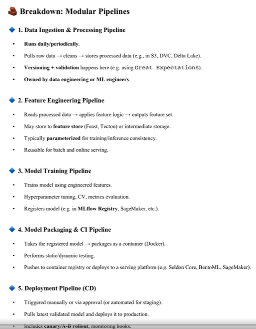
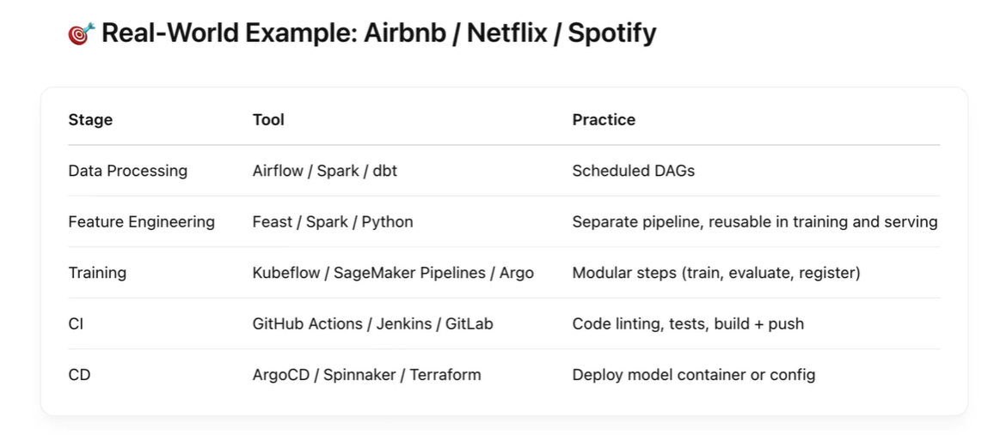

# 🏠 House Price Predictor – An MLOps Learning Project

Welcome to the **House Price Predictor** project! This is a real-world, end-to-end MLOps use case designed to help you master the art of building and operationalizing machine learning pipelines.

You'll start from raw data and move through data preprocessing, feature engineering, experimentation, model tracking with MLflow, and optionally using Jupyter for exploration – all while applying industry-grade tooling.

> 🚀 **Want to master MLOps from scratch?**  
Check out the [MLOps Bootcamp at School of DevOps](https://schoolofdevops.com) to level up your skills.

---

## 📦 Project Structure

```
house-price-predictor/
├── configs/                # YAML-based configuration for models
├── data/                   # Raw and processed datasets
├── deployment/
│   └── mlflow/             # Docker Compose setup for MLflow
├── models/                 # Trained models and preprocessors
├── notebooks/              # Optional Jupyter notebooks for experimentation
├── src/
│   ├── data/               # Data cleaning and preprocessing scripts
│   ├── features/           # Feature engineering pipeline
│   ├── models/             # Model training and evaluation
├── requirements.txt        # Python dependencies
└── README.md               # You’re here!
```

---

## 🛠️ Setting up Learning/Development Environment

To begin, ensure the following tools are installed on your system:

- [Python 3.11](https://www.python.org/downloads/)
- [Git](https://git-scm.com/)
- [Visual Studio Code](https://code.visualstudio.com/) or your preferred editor
- [UV – Python package and environment manager](https://github.com/astral-sh/uv)
- [Docker Desktop](https://www.docker.com/products/docker-desktop/) **or** [Podman Desktop](https://podman-desktop.io/)

---

## 🚀 Preparing Your Environment

1. **Fork this repo** on GitHub.

2. **Clone your forked copy:**

   ```bash
   # Replace xxxxxx with your GitHub username or org
   git clone https://github.com/xxxxxx/house-price-predictor.git
   cd house-price-predictor
   ```

3. **Setup Python Virtual Environment using UV:**

   ```bash
   uv venv --python python3.11
   source .venv/bin/activate
   ```

4. **Install dependencies:**

   ```bash
   uv pip install -r requirements.txt
   ```

---

## 📊 Setup MLflow for Experiment Tracking

To track experiments and model runs:

```bash
cd deployment/mlflow
docker compose -f mlflow-docker-compose.yml up -d
docker compose ps
```

## Some debug tips here 
docker run --rm -it housepricepredictor bash

docker run -idtP housepricepredictor
docker compose up
docker compose build

docker compose stop
docker compose start
docker compose down


> 🐧 **Using Podman?** Use this instead:

```bash
podman compose -f mlflow-docker-compose.yml up -d
podman compose ps
```

Access the MLflow UI at [http://localhost:5555](http://localhost:5555)

---

## 📒 Using JupyterLab (Optional)

If you prefer an interactive experience, launch JupyterLab with:

```bash
uv python -m jupyterlab
# or
python -m jupyterlab
```

---

## 🔁 Model Workflow

### 🧹 Step 1: Data Processing

Clean and preprocess the raw housing dataset:

```bash
python src/data/run_processing.py   --input data/raw/house_data.csv   --output data/processed/cleaned_house_data.csv
```

---

### 🧠 Step 2: Feature Engineering

Apply transformations and generate features:

```bash
python src/features/engineer.py   --input data/processed/cleaned_house_data.csv   --output data/processed/featured_house_data.csv   --preprocessor models/trained/preprocessor.pkl
```

---

### 📈 Step 3: Modeling & Experimentation

Train your model and log everything to MLflow:

```bash
python src/models/train_model.py   --config configs/model_config.yaml   --data data/processed/featured_house_data.csv   --models-dir models   --mlflow-tracking-uri http://localhost:5555
```

---


## Building FastAPI and Streamlit 

The code for both the apps are available in `src/api` and `streamlit_app` already. To build and launch these apps 

  * Add a  `Dockerfile` in the root of the source code for building FastAPI  
  * Add `streamlit_app/Dockerfile` to package and build the Streamlit app  
  * Add `docker-compose.yaml` in the root path to launch both these apps. be sure to provide `API_URL=http://fastapi:8000` in the streamlit app's environment. 


Once you have launched both the apps, you should be able to access streamlit web ui and make predictions. 

You could also test predictions with FastAPI directly using 

```
curl -X POST "http://localhost:8000/predict" \
-H "Content-Type: application/json" \
-d '{
  "sqft": 1500,
  "bedrooms": 3,
  "bathrooms": 2,
  "location": "suburban",
  "year_built": 2000,
  "condition": fair
}'

```

Be sure to replace `http://localhost:8000/predict` with actual endpoint based on where its running. 

## 📋 Test Suite Overview
### 1. **Unit Tests** (`tests/unit/test_inference.py`)
- Focus on core prediction logic with 11 test cases
- 100% mocked dependencies for isolated testing
### 2. **Integration Tests** (`tests/integration/test_docker_api.py`)
- Validate Docker container lifecycle and end-to-end workflows
### 3. **API Tests** (`tests/api/test_endpoints.py`)
- Comprehensive coverage of API endpoints and error handling
### 4. **Docker Tests**
- Ensure container builds and runs correctly
---

## Breakdown: Modular Pipelines
The project is structured into modular pipelines for clarity and maintainability:
- **Data Pipeline**: Cleans and preprocesses raw data
- **Feature Engineering Pipeline**: Transforms data and generates features
- **Modeling Pipeline**: Trains models and logs experiments to MLflow
---



## 🧠 Learn More About MLOps

This project is part of the [**MLOps Bootcamp**](https://schoolofdevops.com) at School of DevOps, where you'll learn how to:

- Build and track ML pipelines
- Containerize and deploy models
- Automate training workflows using GitHub Actions or Argo Workflows
- Apply DevOps principles to Machine Learning systems

🔗 [Get Started with MLOps →](https://schoolofdevops.com)

---

## 🤝 Contributing

We welcome contributions, issues, and suggestions to make this project even better. Feel free to fork, explore, and raise PRs!

---

Happy Learning!  
— Team **School of DevOps**
